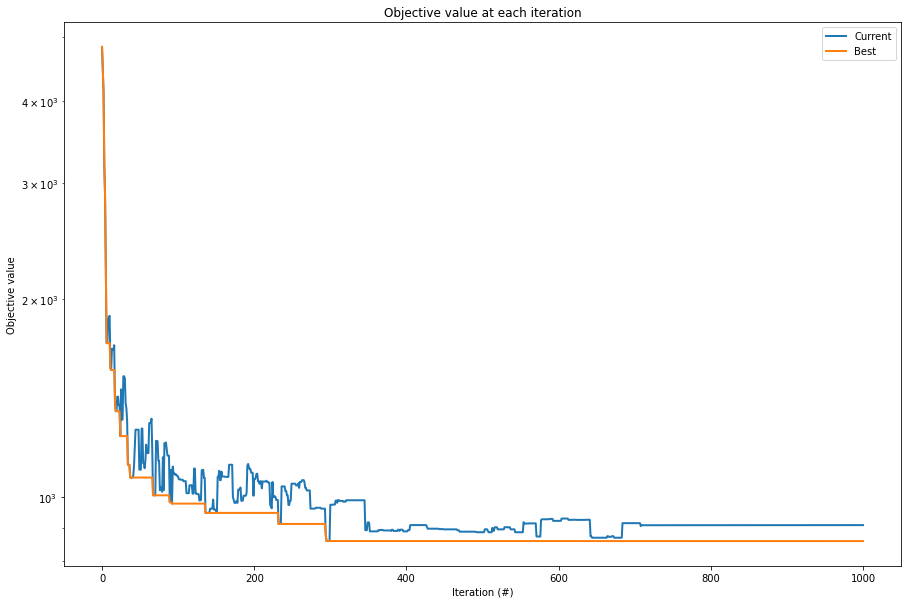
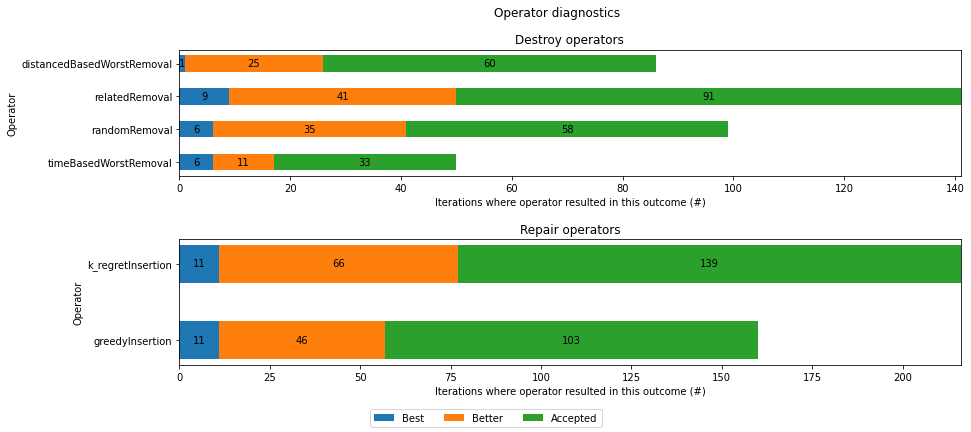

## Adaptive Large Neighborhood Search applied to Technician Vehicle Routing

ALNS (Adaptive Large Neighborhood Search) initially forked from [here](https://github.com/N-Wouda/ALNS) applied to a real-world problem arising in technician vehicle routing. This project models the operational planning of technicians which the ALNS algorithm can interact with. The ALNS algorithm then minimizes the costs arising from:

* Unvisited customers depending on their expected profit
* Vehicle abrasion and fuel
* Overtime depending on the vehicle

An exact mathematical formulation that has been developed for this project can be found [here](docs/Problem.pdf).

The initial route construction is done in two phases: *clustering* and *routing*.

* Clustering is done by a parallel urgency assignment as described in *Tansini, Libertad and Urquhart, María and Viera, Omar. Comparing Assignment Algorithms for the Multi-Depot VRP. 12 2002.*
* Routing is done via a parallel route building algorithm as described in *Potvin, Jean-Yves and Rousseau, Jean-Marc. A Parallel Route Building Algorithm for the Vehicle Routing and Scheduling Problem with Time Windows. European Journal of Operational Research, 66(3):331–340, 1993.*

After constructing the initial solution the ALNS algorithm can be used with various acceptance criteria. Currently implemented are `Hill Climbing`, `Record to Record Travel`, `Simulated Annealing` and `Treshold Acceptance`. 

The available operators for the ALNS algorithm were implemented as defined in *Pisinger, David and Ropke, Stefan. Large Neighborhood Search. Handbook of Metaheuristics, pages 399–419, 09 2010.* 

```
alns = ALNS()

alns.add_destroy_operator(Operators.randomRemoval)
alns.add_destroy_operator(Operators.distancedBasedWorstRemoval)
alns.add_destroy_operator(Operators.timeBasedWorstRemoval)
alns.add_destroy_operator(Operators.relatedRemoval)
alns.add_repair_operator(Operators.greedyInsertion)
alns.add_repair_operator(Operators.k_regretInsertion)

criterion = RecordToRecordTravel.RecordToRecordTravel(0.2, 0.00000000000001, 0.0002, method = "linear")

result = alns.iterate(solution, [3, 2, 1, 0.5], 0.8, criterion, iterations=1000, collect_stats=True)
optimized = result.best_state

_, ax = plt.subplots(figsize=(15, 10))
ax.set_yscale('log')
result.plot_objectives(ax=ax, lw=2)
```



```
figure = plt.figure("operator_counts", figsize=(14, 6))
figure.subplots_adjust(bottom=0.15, hspace=.5)
result.plot_operator_counts(figure=figure, title="Operator diagnostics", legend=["Best", "Better", "Accepted"])
```



Example notebooks on how to use the optimization can be found in the `examples` folder.

## Run a Docker Container for development

In the root directory run `docker build -t alns .`

Start a container `docker run -p 8888:8888 alns`

Copy the security token from the command line and use it login on http://localhost:8888/tree. 
